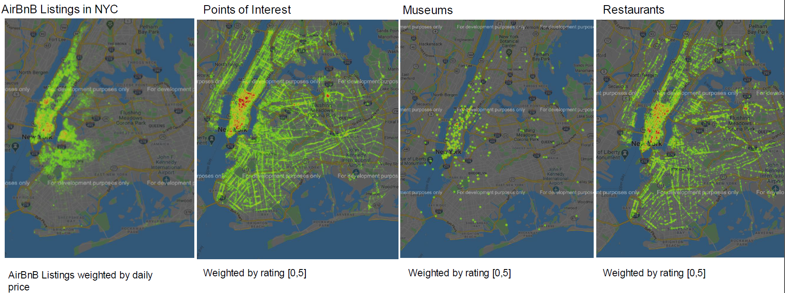

# Airbnb New York City data study

for participation in [AI Hack 2020](https://aihack.org/), Imperial College London

## Background

Human hospitality has been a cultural staple for thousands of years, with civilizations ranging from Ancient Rome to early industrial England regularly offering basic accommodations to travelers. However, higher-end accommodations did not come about until 1768, when the Royal Clarence Hotel, the world’s first “hotel” in the modern sense, was opened in the cathedral city of Exeter. Even then, the “hotel” concept only really caught on half a century later, when Claridge’s, the first 5-star hotel, opened in 1812​. Throughout the 19th century, numerous hotel chains sprung up in Western Europe and North America, including the now famous Ritz luxury hotel chain (currently known as the Ritz-Carlton chain). The hoteling industry enjoyed a period of great expansion in the 20th century, as it spread its reach both economically and geographically.

But in 2007, recent college graduates Brian Chesky and Joe Gabbia embarked on a mission to solve a distinctly ​Millennial problem: affording rent in an expensive city. a little known company called AirBed & Breakfast. Although initially just an air mattress in their living room with breakfast service, it soon evolved into thousands of listings and tens of thousands of users. Soon enough, AirBed & Breakfast extended its reach across the globe, ballooning to a ​valuation of over $30 billion as of March 2017​. Airbnb,as it came to be known since March 2009,is now posing a serious challenge to the traditional hoteling industry by leveraging the distinctly 21s​ t century “​sharing economy​” concept.

Airbnb has been a great boon to renters on their platform, solving for them the same problem that its founders had a decade ago when they graduated from college: affording their apartment rent via subletting it out to others when they weren’t using it. However, it has forced hoteling industry incumbents to find new ways of differentiating their services, as the increased competition has driven down prices and put a sizable dent in the low- to middle-end business. With ​the war between hotels and Airbnb reaching a boiling point in NYC,​ it seems like we are on the cusp of a watershed event that could revolutionize the rental market.

## Problem

Airbnb is an increasingly popular alternative to expensive hotels for tourists on a budget. It also gives renters and homeowners an opportunity to earn some income by subletting or renting their homes out when they are not using it

New York City, one of the top but expensive tourist destinations has a significantly high count of Airbnb listing.

This project will hence attempt to analyse NYC data from the Airbnb platform and through data visualisations, gain insights towards the following objectives:

1. Maximuise bookings for homeowners
2. Help guests optimise for the best deals

## Datasets Used

### **Launch Notebook**

|          Platform         |                                                              Click Button To Launch                                                              |
|:-------------------------:|:------------------------------------------------------------------------------------------------------------------------------------------------:|
|        Google Colab       |  |
| Standard Jupyter Notebook |                                     |

[Datasets detailed schema](https://github.com/terenceneo/Airbnb-NYC-data-study/blob/master/Housing%20Tables%20Schema.docx)

### **Datasets**

### listings

Descriptive information on tens of thousands of Airbnb listings along the U.S. East Coast. 59,824rows&29columns.S​ ize:~30MB.Source:​Airbnb​.

### calendar

Basic information on the Airbnb listing calendar.
~20millionrows&5columns.S​ ize:~55MBzipped,~675MBunzipped.Source:​Airbnb​.

### demographics

Demographic data (population, age, income level, etc.) by zip code, taken from 2011 – 2015. 33,120rows&26columns.S​ ize:~0.5MB.Source:​U.S.Census​.

### econ_state

Economic data (GDP, personal income, unemployment rate, etc.) for all 50 states and the District of Columbia, taken from 1980 – 2016.
51 rows & 519 columns.​ Size: ~0.2MB. Source: ​U.S. Bureau of Economic Analysis​.

### real_estate

Monthly data that represent real estate prices, organized alphabetically by city and state. Specifically, monthly values from the Zillow Home Value Index (ZHVI) and the Zillow Rent Index (ZRI) for all homes (single-family residence & condo/co-op).
29,111 rows & 261 columns.​ Size: ~10MB zipped, ~40MB unzipped. Source: ​Zillow​.

### venues

Important details about hundreds of thousands of venues in the metropolitan areas included in listings​.
267,958 rows & 7 columns.​ Size: ~8MB zipped, ~30MB unzipped. Source: ​Google Places​.

## Toolsets

- Jupyter notebook with Python 3.7
- Tableau Desktop

## View project

- [Slide Deck](https://github.com/terenceneo/Airbnb-NYC-data-study/blob/master/Holiday%20homes%20in%20the%20Big%20City.pdf)

## The Team

- [Terence Neo](https://www.linkedin.com/in/terencenyy/), University of Oxford
- [Robert Shi](https://github.com/rshi159), University of Oxford
- [Lim Yi-Min](https://www.linkedin.com/in/yi-min-lim-547a8078/), University College London
- [Denise Eng](https://www.linkedin.com/in/denise-eng/), Imperial College London